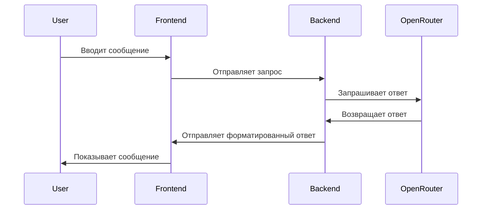

# Документация проекта AI Chat

## 📌 Обзор
Проект представляет собой веб-приложение для общения с ИИ-моделями через OpenRouter API. Поддерживает:
- Текстовые сообщения
- Изображения
- Markdown с подсветкой кода
- Несколько моделей ИИ
- Темную/светлую тему

## 🛠 Технологии
### Бэкенд
- **FastAPI** - веб-фреймворк
- **OpenRouter** - доступ к разным моделям ИИ
- **UVicorn** - ASGI сервер
- **CORS** - межсайтовые запросы

### Фронтенд
- **React** - основная библиотека
- **Framer Motion** - анимации
- **Material-UI** - UI компоненты
- **React-Markdown** - рендеринг Markdown
- **LocalStorage** - хранение чатов

## 🚀 Возможности
### Основные функции
1. **Чат с ИИ**:
   - Поддержка нескольких моделей (DeepSeek, Mistral)
   - История сообщений
   - Форматирование ответов (Markdown)

2. **Работа с изображениями**:
   - Загрузка изображений
   - Отображение в чате
   - Анализ изображений моделями

3. **Интерфейс**:
   - Темная/светлая тема
   - Анимации
   - Адаптивный дизайн

## 📂 Структура проекта
```
src/
├── App.jsx        # Главный компонент
├── app.py         # Бэкенд
├── components/
│   ├── MessageInputContainer.jsx  # Поле ввода
│   ├── Sidebar.jsx                # Боковая панель
│   └── ...
└── ...
```

## 🔧 Установка и запуск
1. Установите зависимости:
```bash
npm install
pip install -r requirements.txt
```

2. Настройте переменные окружения:
```env
AI_TOKEN=your_openrouter_key
PORT=10000
```

3. Запустите:
```bash
# Бэкенд
python src/app.py

# Фронтенд
npm run dev
```

## 📝 Примеры кода
### Отправка сообщения (фронтенд)
```jsx
const sendMessage = async () => {
  const response = await fetch('https://hdghs.onrender.com/chat', {
    method: 'POST',
    headers: { 'Content-Type': 'application/json' },
    body: JSON.stringify({ userInput: input })
  });
  // Обработка ответа...
};
```

### Обработка запроса (бэкенд)
```python
@app.post("/chat")
async def chat_handler(chat_data: ChatRequest):
    response = await client.chat.completions.create(
        model="google/gemini-2.5-pro-exp-03-25:free",
        messages=[{"role": "user", "content": chat_data.userInput}]
    )
    return {"content": response.choices[0].message.content}
```

## 🎨 UI Компоненты
### Поле ввода

- Поддержка многострочного ввода
- Кнопка отправки
- Загрузка изображений

### Сообщения

- Разные стили для пользователя и ИИ
- Подсветка кода
- Отображение изображений

## 🔄 Workflow


## 💡 Рекомендации по улучшению
1. Добавить авторизацию
2. Реализовать синхронизацию между устройствами
3. Добавить больше моделей ИИ
4. Улучшить обработку ошибок
5. Добавить голосовой ввод

## 📞 Контакты
Для вопросов и предложений: developer@example.com
